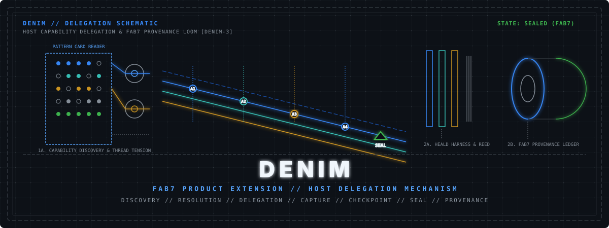

<p align="center">
  
</p>

# Denim

**Clear guidance for increasingly capable agents, with a user-owned boundary
for deciding when work is done.**

## Philosophy

Denim starts from two beliefs:

1. Host agents are becoming more intelligent and more capable of solving
   complex problems. Increasingly, they need clear guidance more than another
   layer trying to reproduce their intelligence.
2. Generic third-party static skill sets that pre-package reasoning will age
   quickly and become obsolete as host agents absorb those capabilities.

Your own business skills and workflows are different. They carry your rules,
context, and intent—knowledge a general host cannot simply guess.

Denim does not compete with the host agent. It automatically maps the user's
issue to the most suitable capability currently available in the host, gives
the host clear guidance, and captures the outcome. The host remains responsible
for doing the actual work.

## What Denim solves

- You do not need to manually choose a tool, skill, or agent for every issue.
- Your business-specific guidance can take priority when it fits the issue.
- Work can span several asks without handing ownership of the workflow to
  Denim.
- You decide when a unit of work is complete.
- You can keep evidence of what the agent returned when you made that decision.

## Denim features

- **Automatic capability mapping** — connects each issue to a suitable
  capability already available in the host.
- **Business guidance first** — prefers your relevant skills and workflows over
  generic behavior.
- **User-owned units of work** — one unit can include multiple Denim asks and
  ordinary work with the host.
- **One clear outcome per ask** — preserves the result together with its
  limitations and effects.
- **Seal when you decide it is done** — closes the current unit and records its
  evidence through [Fab7](https://github.com/fab7hq/fab7).
- **One experience across hosts** — uses the same simple Denim model while each
  host keeps its native strengths.

## How it feels

```text
denim:ask Review the authentication design

Continue working normally with the host...

denim:ask Re-review the resulting implementation
denim:seal
```

Use `denim:ask` whenever you want Denim to map an issue and preserve the
outcome. Between asks, work with the host normally. When you decide the unit is
done, use `denim:seal`. The conversation can continue, and the next ask begins
the next unit.

Sealing provides integrity and provenance evidence for the captured outcomes.
It does not guarantee that an agent's answer, review, or code is correct.

## Get started

Initialize Fab7 in your workspace, refresh the reviewed extension catalog over
the network, install Denim from
[`fab7hq/ext-registry`](https://github.com/fab7hq/ext-registry), and start a new
host session:

```sh
fab7 init --workspace /path/to/workspace
fab7 ext refresh
fab7 ext install denim --host HOST
```

Replace `HOST` with `claude` or `codex`, then use the host's normal skill
trigger for `denim:ask` and `denim:seal`. No local Denim checkout is required.

## Install from your agent host

Already working inside a supported agent CLI? Use the host's normal skill
trigger for this host-neutral request:

```text
fab7:ext-install denim
```

Fab7 will find Denim in the reviewed extension registry, explain the download
and native installation, and ask for your approval before making changes. When
installation finishes, follow the activation instructions it returns, start a
fresh host session, and use `denim:ask` and `denim:seal`.

This uses the same network and
[`fab7hq/ext-registry`](https://github.com/fab7hq/ext-registry) path as the
terminal installation. No local Denim checkout is required.

## Learn more

- [Concepts and configuration](docs/overview.md)
- [Host setup and owner-run journeys](docs/agents.md)
- [Architecture and evidence boundaries](docs/architecture.md)
- [System diagrams](docs/diagrams.md)

## Community and support

- Ask usage questions in [Fab7 Discussions](https://github.com/fab7hq/fab7/discussions).
- Report reproducible Denim defects with the focused [issue form](https://github.com/fab7hq/denim/issues/new/choose).
- Read [CONTRIBUTING.md](CONTRIBUTING.md) before submitting a pull request.
- Report vulnerabilities privately through the process in [SECURITY.md](SECURITY.md).

## License

Licensed under the [Apache License 2.0](LICENSE).
