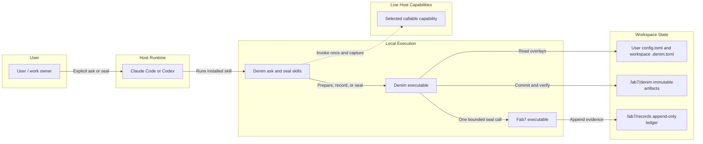
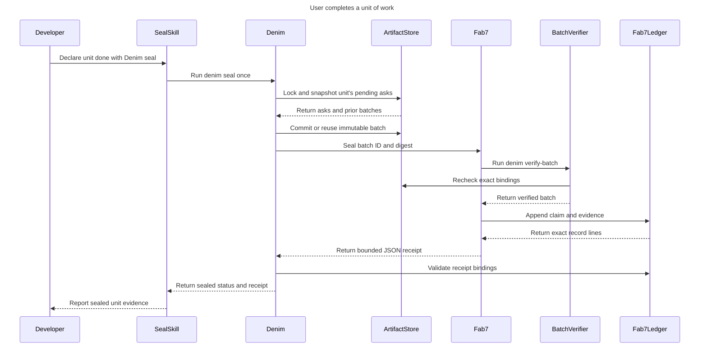

# Denim system diagrams

These diagrams describe Denim's current explicit ask-and-seal architecture.
The host owns its live capability inventory, permissions, and native capability
invocation. Denim owns validation, deterministic resolution, exact-result
capture, immutable batching, and the single bounded Fab7 seal call.
The user owns the unit of work, may issue multiple asks within it, and decides
that it is done by invoking seal.

## System architecture



The Denim executable is one local program. Internally, `cli.py` dispatches to
the ask or seal path; discovery and configuration feed the deterministic
resolver; the store validates and atomically commits immutable artifacts; and
the Fab7 adapter owns the only Fab7 subprocess.

## Ask sequence

```mermaid
sequenceDiagram
    title Denim ask lifecycle
    participant Developer
    participant HostSkill
    participant HostRuntime
    participant Denim
    participant Resolver
    participant Capability
    participant ArtifactStore

    Developer->>HostSkill: Invoke explicit Denim ask
    HostSkill->>HostRuntime: Read live inventory
    HostRuntime-->>HostSkill: Descriptors and authority
    HostSkill->>Denim: Submit prepare request
    Denim->>Resolver: Validate, filter, and rank
    Resolver-->>Denim: Capability and bound ticket
    Denim-->>HostSkill: Ticket and enriched prompt
    HostSkill->>HostRuntime: Invoke selected capability
    HostRuntime->>Capability: Send enriched prompt once
    Capability-->>HostRuntime: Return exact final result
    HostRuntime-->>HostSkill: Capture bounded result
    HostSkill->>Denim: Submit record request
    Denim->>ArtifactStore: Commit result and ask record
    Denim-->>HostSkill: Return status and ask ID
    HostSkill-->>Developer: Report result; unit remains open
```

Capability selection is deterministic after the host supplies the snapshot:

1. Keep only visible, callable, result-capturable capabilities whose required
   authorities were granted.
2. Honor an eligible exact `use` ID, then an eligible configured `route`.
3. Rank specific positive matches by configured origin order, prompt-token
   overlap with scoped `provides`, priority, and capability ID.
4. Only when no specific candidate matches, rank `*` wildcard fallbacks by
   origin order, priority, and capability ID.
5. If nothing matches, commit `capability_unavailable` during preparation and
   do not invoke a capability.

The default origin order is custom business behavior, host built-in,
third-party or provenance-ambiguous plugin, then generic native fallback.
Eligibility and pins remain stronger than that preference.

## Seal sequence



A successful seal proves integrity and provenance for the exact recorded ask
outcomes and records the user's completion boundary for that unit. It does not
prove that a model-authored result is semantically correct. Failed or unsealed
batches remain pending, so the unit is not sealed and may be retried.
